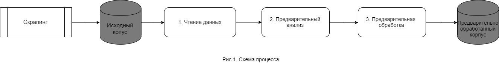
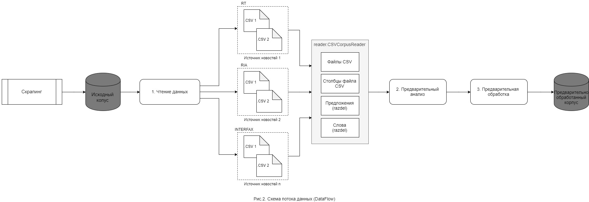

# Оглавление
1. [Описание](#description)
    1. [Глоссарий](#glossary)
    2. [Введение](#introduction)
2. [Цели и задачи](#statements)
    1. [Цель](#purpose)
    2. [Задачи](#task)
3. [Схема процесса и dataflow](#process)
	1. [Описание шагов процесса](#steps)
		1. [Чтение данных](#readdata)
		2. [Предварительныый анализ](#analisys)
		3. [Предварительная обработка](#processing)
4. [Требования к структуре](#structure)
    1. [Требования для исходного корпуса данных](#source)
    2. [Требования для обработанного корпуса данных](#receiver)
5. [Сценарии использования](#usecases)
    1. [Иницилизация корпуса документов](#usecase1)
    2. [Просмотр каталогов и файлов в корпусе](#usecase2)
    3. [Просмотр размера файлов, которые будут обрабатываться](#usecase3)
    4. [Показать общую информацию по каталогу новостного источника, либо по файлов из конкретного источника](#usecase4)
    5. [Получить словарь из обработанных файлов и вывести топ-20 слов](#usecase5)
    6. [Количество рубрик](#usecase6)
    7. [Рубрики в разделе количества новостей](#usecase7)
    8. [Загрузка данных в pandas для анализа](#usecase8)

# Описание <a name="description"></a>
## Глоссарий <a name="glossary"></a>

Термин | Определение
--------:|:-------- 
Корпус | Структура файлов и каталогов на диске, где хранятся текстовые данные для последующего анализа и обработки
Категория | Название источника новостей, каталога на диска, куда скрапятся данные по источнику новостей
Рубрика | Раздел новостного источника, к которому относится новость

## Введение <a name="introduction"></a>
Документ описаывает процесс работы с промежуточными данными, полученные в ходе скрапинга, а также содержит примеры реализации

# Цели и задачи <a name="statements"></a>
## Цель <a name="purpose"></a>
Анализ датасетов полученных скраппингом. Выполняется анализ корпуса документов, в который попадают файлы, предварительный анализ для получения общей информации, а также EDA перед предобработкой и дальнешем преобразованием корпуса в признаки для модели.

## Задачи <a name="task"></a>
1. Анализ файлов из корпуса документов
2. Получение общей информации об обрабатываемых документах.
	Получение начальных данные должно включать следующие показатели:
	+ Количество файлов. Все файлы указанные пользователем для обработки. Либо если пользователь указывает директории для обработки, то количество всех файлов из этих директорий
	+ Количество новостных источников. Количество указанных директорий пользователем.
	+ Количество обработанных новостей. Все записи из каждого файла CSV
	+ Количество предложений. Общее количество предложений по всем новостям.
	+ Количество слов. Общее количество слов по всем новостям без учета повторений.
	+ Количество токенов (словарь). Общее количество слов по всем новостям, с учетом повторений.
	+ Коэффициент лексического разнообразия (lexical diversity). Отношение общего количество слов к словарю.
	+ Среднее количество новостей по отношению к файлам. 
	+ Среднее количество предложений в новостях
	+ Начальная дата в обработке. Дата первой новости из всех обрабатываемых файлах
	+ Конечная дата в обработке. Дата последней новости из всех обрабатываемых файлах
	+ Количество повторяющихся новостей. Количество одинаковых новостей в обрабатываемых файлах
	+ Количество пустых новостных элементов. В строке CSV файла отсутсвует новость.
	+ Время обработки в секундах. Время от запуска обработки, до полного выполнения.

3. Начальный сбор токенов для дальнейшего анализа, при получении начальных данных. Для экономии времени
4. Получение информации о размере обрабатываемых файлов, для оценки и выявления аномально больших
5. По прочитанному корпусу проведение EDA перед дальнейшем преобразованием
6. Разделение каждой новости на предложения.
7. Разделение каждого предложения на отдельные слова, для каждой новости.

# Схема процесса и dataflow <a name="process"></a>


## Описание шагов процесса <a name="steps"></a>

### Чтение данных <a name="readdata"></a>
Пользователь делает просмотр датасетов, которые были получены скрапингом. После этого принимается решение какие файлы требуется проанализировать. Для этого предусмотрены методы чтения в системе.
Пользователь указывает путь и может увидеть все имеющиеся необработанные файлы или директории в которых лежат файлы. По требованиям названия директории соответствует имени источника данных.
Пользователь проверяет размер файлов, для выявления аномально больших размеров. После принятия решения, пользователь имеет возможность либо указать список файлов, либо список директорий для обработки (в таком случае попадут все файлы из директорий).
При указаннии нескольких элементов система подготовит предварительный анализ по всем.

### Предварительный анализ <a name="analisys"></a>
Пользователь вызывает метод получения общей информации по заданным критериям. Если полученные результаты устраивают, то можно приступить к детальному анализу EDA, либо сразу сделать предварительную обработку.

### Предварительная обработка <a name="processing"></a>
*В процессе написания и реализации*

# Требования к структуре <a name="structure"></a>
## Требования для исходного корпуса данных <a name="source"></a>
Исходный корпус - это хранилище на дисковом пространстве, в которое помещаются файлы, полученные скпапингом. Именно с ним на первом этапе работает пользователь.
+ В директории interim, где храняться промежуточные файлы полученные скраппингом должны быть дочернии папки, название которых является источником новостной ленты
+ Название файла должно иметь следующий формат: ```<дата/время>_<источник>.csv```
На рисунке 3 показан пример правильно организованной структуры


## Требования для обработанного корпуса данных <a name="receiver"></a>
Обработанный корпус - это хранилищена диске, в которое помещаются файлы, которые пользователь проанализировал и запустил процесс предварительнной обработки.
*В процессе написания и реализации*

# Сценарии использования <a name="usecases"></a>
## Иницилизация корпуса документов <a name="usecase1"></a>
```python
from reader import CSVCorpusReader
data = CSVCorpusReader('./data/corpus')
```

## Просмотр каталогов и файлов в корпусе <a name="usecase2"></a>
```python
>>> data.categories()
['gazeta', 'interfax', 'iz', 'meduza', 'ria', 'rt', 'tass', 'rbc']
```
```python
>>> data.fileids()
['gazeta/gazeta.csv',
 'interfax/interfax.csv',
 'iz/iz.csv',
 'meduza/meduza.csv',
 'ria/ria.csv',
 'rt/rt.csv',
 'tass/tass.csv', 
 'rbc/rbc_01.csv', 
 'rbc/rbc_02.csv']
```
## Просмотр размера файлов, которые будут обрабатываться <a name="usecase3"></a>
В разрезе категорий (Показывает все файлы из указанной категории):
```python
>>> list(data.sizes(None, 'rt'))
[(FileSystemPathPointer('C:\\projects\\datascience\\proj_news_viz\\nlp\\data\\interim\\rt\\rt.csv'), 225108812)]
```
В разрезе файлов (Показывает только те файлы из указанной категории, по которым требуется анализ):
```python
>>> list(data.sizes(['rbc/rbc_01.csv','rbc/rbc_02.csv'], None))
[(FileSystemPathPointer('C:\\projects\\datascience\\proj_news_viz\\nlp\\data\\interim\\rbc\\rbc_01.csv'), 3252), (FileSystemPathPointer('C:\\projects\\datascience\\proj_news_viz\\nlp\\data\\interim\\rbc\\rbc_02.csv'), 1202)]
```
## Показать общую информацию по каталогу новостного источника, либо по файлов из конкретного источника <a name="usecase4"></a>
```python
>>> data.describe(None, 'rt')
{'Количество файлов': 1,
 'Количество источников новостей': 1,
 'Количество обработанных новостей': 106644,
 'Количество предложений': 510836,
 'Количество слов': 19411353,
 'Количество токенов (словарь)': 428499,
 'Коэффициент лексического разнообразия (lexical diversity)': 1.0,
 'Среднее количество новостей по отношению к файлам': 106644.0,
 'Среднее количество предложений в новостях': 4.790105397396947,
 'Начальная дата в обработке': '2014-06-16 18:36:02',
 'Конечная дата в обработке': '2019-08-02 14:10:00',
 'Количество повторяющихся новостей': 293,
 'Количество пустных новостных элементов': 12,
 'Время обработки в секундах': 414.42461347579956}
```
## Получить словарь из обработанных файлов и вывести топ-20 слов <a name="usecase5"></a>
```python
>>> tokens = data.gettokens
>>> from collections import Counter
>>> Counter(tokens).most_common(20)
[(',', 1217890),
 ('.', 991772),
 ('n', 791962),
 ('в', 574399),
 ('и', 329817),
 ('«', 325639),
 ('»', 322876),
 ('на', 260070),
 ('что', 227449),
 ('—', 212876),
 ('с', 163978),
 ('не', 144792),
 ('по', 118818),
 ('В', 82004),
 (')', 79400),
 ('(', 79231),
 (':', 73616),
 ('Ранее', 68995),
 ('о', 61487),
 ('России', 56185)]
```
## Количество рубрик <a name="usecase6"></a>
```python
>>> len(set(list(data.listcolumns(None, 'rt', 'topics'))))
10
```
## Рубрики в разделе количества новостей <a name="usecase7"></a>
```python
>>> Counter(tokens).most_common(20)
>>> Counter(list(data.listcolumns(None, 'rt', 'topics')))
Counter({'Россия': 32963, 'Спорт': 26702, 'Мир': 26476, 'Бывший СССР': 10078, 'Без политики': 4489, 'Экономика': 4321, 'Наука': 1496, 'Пресс-релизы': 92, 'Новости партнёров': 14, 'Мероприятия RT': 13}) 
```
## Загрузка данных в pandas для анализа <a name="usecase8"></a>
```python
df = pd.DataFrame(list(data.docs(None, 'rt')))
```
