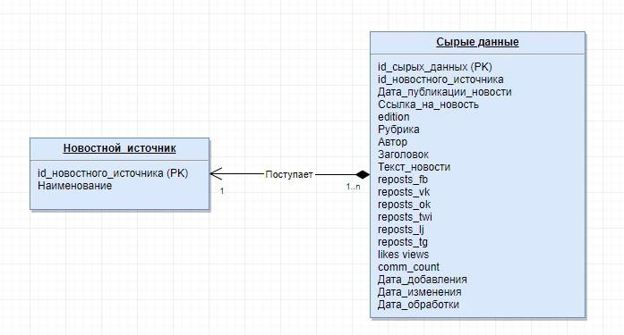

# Оглавление
1. [Описание](#description)
    1. [Введение](#introduction)
2. [Цели и задачи](#statements)
    1. [Цель](#purpose)
    2. [Задачи](#task)
2. [Структура хранилища данных](#warehouse)
    1. [Схема базы данных для сырых данных](#raw_data)
		1. [Логическая схема](#raw_data_logic)
		2. [Физическая схема](#raw_data_physical)
    2. [Схема базы данных для обработанных данных](#prepared_data)
		1. [Логическая схема](#prepared_data_logic)
		2. [Физическая схема](#prepared_data_physical)	
3. [Схема процесса и dataflow](#process)
	1. [Описание](#steps)
4. [Требования к структуре](#structure)
    1. [Требования для исходного корпуса данных](#source)
5. [Сценарии использования](#usecases)
    1. [Размещение данных из файлов в базу данных](#usecase1)
    2. [Запуск процесса обработки данных](#usecase2)


# Описание <a name="description"></a>
## Введение <a name="introduction"></a>

# Цели и задачи <a name="statements"></a>
## Цель <a name="purpose"></a>

## Задачи <a name="task"></a>
1. Загрузка сырых данных из имеющих файлов .csv в базу данных.
2. Ежедневый запуск процесса обработки сырых данных и подготовка данных к работе.

# Структура хранилища данных <a name="warehouse"></a>
## Схема базы данных для сырых данных <a name="raw_data"></a>
### Логическая схема <a name="raw_data_logic"></a>

### Физическая схема <a name="raw_data_physical"></a>


## Схема базы данных для обработанных данных <a name="prepared_data"></a>
### Логическая схема <a name="prepared_data_logic"></a>

### Физическая схема <a name="prepared_data_physical"></a>


# Схема pipeline<a name="process"></a>


## Описание <a name="steps"></a>
Процесс работает с имеющимися данными и загружает их в базу. Когда будет доработан скрапинг и новые данные по новостям польются в базу напрямую, старые данные останутся.
Концепция такая:
1) База данных одна, но с двумя схемами - в одной структура для сырых данных, в другой - для обработанных
2) Транспорт данных между ними обеспечивает ETL - в нашем случае luigi
3) В ввиду того, что уже есть большое количество данных, полученных скрапингом то:
   - Залить имеющиеся данные в БД, в схему для сырых данных
   - Написать обработчик на luigi, который будет брать данные из сырых, обрабатывать и записывать в схему для обработанных.
   - Такая структура даст нам возможность, когда будет допилен скрапинг безболезненно загружать новые данные к имеющимся (как? об этом ниже)
4) В таблице сырых данных добавляется поле batch_date, это дата заверешения процесса трансформации данных, т.е. когда luigi взял данные, обработал и положил в структу обработанных данных.
5) Соответствено, когда скрапинг будет передан для прямой записи в базу, а не в csv, то у новых записей batch_date будет не заполнено - что будет является триггером для luigi, который по этому полю будет брать в обработку только новые данные.
Итог:
1) Базу данных с сырыми и обработанными данными
2) Обработку на luigi
3) Контроль над данными - если что-то пойдет не так, то получим откат всех данных, которые остануться в сырых и по которым можно будет провести анализ на предмет, что не так (как раз то самое поле batch_date, которое заполняется для каждой новости, оно будет пустое).
4) Безболезненный переход, когда переделается скрапинг. Судя по тому, как RT публикует данные, запускать скрапинг каждый день не имеет смысла, также не имеет смысла, заново делать вставку и обрабтку всех данных, после переделки паука - достаточно грузануть будет только новые данные.
5) Для luigi можно сделать шедулер, который раз в день будет лазить в схему сырых данные и по полю batch_date определять, появились ли новости для обработки

# Сценарии использования <a name="usecases"></a>
## Размещение данных из файлов в базу данных <a name="usecase1"></a>
```python
>>> from reader import CSVCorpusReader
>>> data = CSVCorpusReader('./data/corpus')
>>> from preprocess import Dbwriter
>>> prep = Dbwriter(data)
>>> prep.write_file(None, ['rt'])
rt
Количество строк в файле rt/rt.csv: 106644
Время обработки в секундах: 11041.725292921
['rt/rt.csv is done']
```

## Запуск процесса обработки данных <a name="usecase2"></a>
```python
>>> python preprocess.py UpdateBatchDate
```
