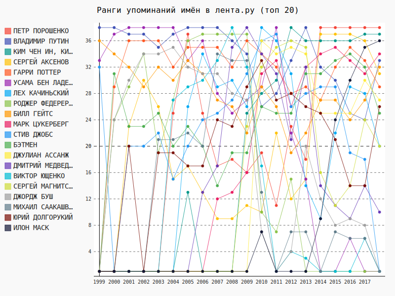
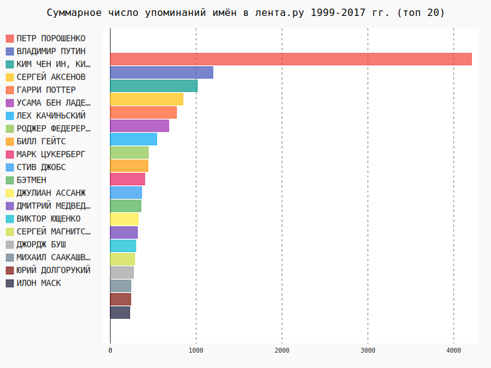

# Графики упоминаний имён в Лента.Ру
### Что здесь нарисовано:  
На графике изображены ранги от числа упоминаний соответствующих имён. Чем больше, тем чаще. Сохраняются отношения больше/меньше, но пропорции игнорируются ради читаемости.

Абсолютные величины для сравнения масштабов на графике ниже:  

Юрий Долгорукий -- это не совсем ошибка. Это атомная подводная лодка, которую, как оказалось, упоминали в лента.ру.  
Картинки интерактивны: для этого нужно скачать их и открыть в браузере. Гитхаб отключает анимации и интерактив в svg вставленных в markdown ради безопасности.
